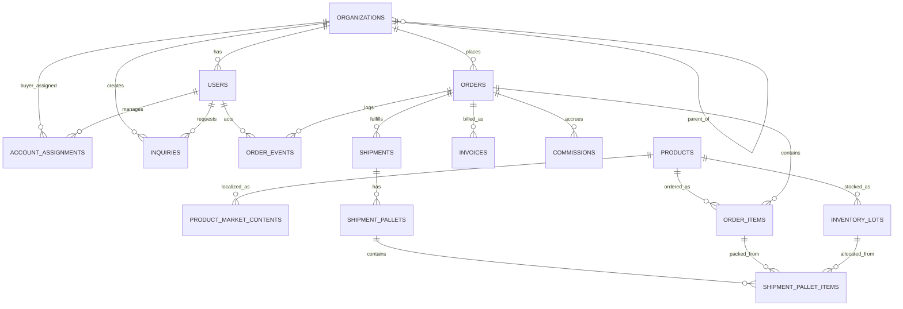

# Trade Intel MVP Data Model

## 설계 원칙

1. 테이블 수를 억지로 늘리지 않는다.
2. 하지만 주문 확정, lot 기반 유통기한, 팔레트 패킹 추적은 반드시 구조화한다.
3. 화면/업무 흐름이 복잡한 부분은 상태값과 이벤트 로그로 풀고, 단계별 별도 테이블을 남발하지 않는다.
4. 제품 정보는 과도하게 쪼개지 말고 `제품 마스터 + 국가별/언어별 확장정보` 2단 구조로 간다.
5. AI 영업, 화상미팅, 고급 CRM은 MVP 핵심 흐름이 안정된 뒤 확장한다.

## 추천 기술 전제

- DB: PostgreSQL
- 가변 필드: `jsonb`
- 문서 저장: S3 같은 오브젝트 스토리지 + DB 메타데이터

## 시스템 경계

### 1) Supabase 앱 프로젝트

바이어 포털, 벤더 포털, 주문, 출고, 문서, 문의, 권한 관리를 담당하는 운영 DB다.

이 문서의 대부분 테이블은 이 프로젝트 안에 둔다.

### 2) MES 프로젝트

재고, lot, 생산 예정 정보의 원천 시스템이다.

`inventory_lots`, `supply_plans`는 Supabase에서 직접 입력하는 운영 테이블이 아니라, MES에서 주기적으로 동기화되는 미러/캐시 테이블로 본다.

즉, 원천 진실은 MES에 있고, Supabase는 주문 검토와 출고 판단을 위해 조회 가능한 operational copy를 가진다.

### 3) Sales Board 프로젝트

영업 보드, 실적 관리, CRM, AI 영업 액션은 별도 프로젝트로 분리한다.

운영 주문/물류 데이터와 영업 전략 데이터는 같은 DB에 섞지 않는 것이 맞다.

## 데이터 소스 오브 트루스

### Supabase가 직접 관리하는 것

- 조직/계정/권한
- 제품 마스터와 국가별 상품 콘텐츠
- 주문/승인/이벤트
- 출고/패킹/문서
- 문의

### MES가 원천인 것

- lot 재고
- 생산 예정 수량
- 입고 예정
- 전산 재고 신뢰도 관련 보조 정보

### Sales Board가 원천인 것

- 영업 활동 로그
- CRM 파이프라인
- 세일즈 캠페인
- AI 제안/레터 발송 이력
- 성과 분석용 가공 데이터

## 프로젝트 분리 원칙

### Supabase 운영 프로젝트와 Sales Board를 분리하는 이유

1. 바이어/벤더 포털의 운영 데이터와 내부 영업 전략 데이터를 논리적으로 분리할 수 있다.
2. RLS 정책을 단순하게 유지할 수 있다.
3. 내부 영업 분석이나 AI 실험이 운영 트랜잭션에 영향을 주지 않는다.
4. 향후 외부 파트너 포털을 열어도 민감한 CRM 데이터가 섞이지 않는다.

### 추천 원칙

- 운영 프로젝트에서 Sales Board 프로젝트로 단방향 동기화를 기본으로 한다.
- Sales Board에서 운영 주문 상태를 직접 수정하지 않는다.
- 운영 프로젝트와 MES도 가능하면 `MES -> Supabase` 단방향 동기화로 유지한다.
- 사람이 개입하는 확정 행위는 항상 Supabase 운영 프로젝트에서 발생하게 한다.

## 동기화 권장 방식

### MES -> Supabase

추천 방식:

1. MES가 배치 또는 이벤트로 재고/생산 데이터를 전달
2. Supabase에 `inventory_lots`, `supply_plans` 업서트
3. 마지막 동기화 시각과 원천 reference를 저장

필수 원칙:

- MES 원천 키를 별도 컬럼으로 저장한다.
- 재고는 덮어쓰기보다 snapshot 시각을 남긴다.
- lot 소진/변동 추적이 필요하면 나중에 `inventory_sync_logs`를 추가한다.

### Supabase -> Sales Board

추천 방식:

1. confirmed 주문, 출고, 매출성 이벤트만 전달
2. 거래처/제품/주문 요약 데이터를 비식별 또는 최소화해서 복제
3. Sales Board는 조회/분석/활동 관리 중심으로 사용

필수 원칙:

- Sales Board는 원천 주문 row 전체를 다 복제하지 않는다.
- 영업활동에 필요한 최소 필드만 projection 한다.
- 커미션/실적은 운영 주문 snapshot을 바탕으로 계산한다.

## MVP 핵심 테이블

### 1) organizations

사용자 소속과 거래 구조를 하나의 조직 테이블로 통합한다.

- `id`
- `org_type`
  - `internal`
  - `vendor`
  - `buyer_country`
  - `buyer_company`
  - `buyer_ship_to`
- `parent_org_id`
- `code`
- `name`
- `country_code`
- `currency_code`
- `status`
- `metadata_json`

설명:

- 바이어의 `국가 > 업체 > 하위 발주처` 위계를 self-reference로 처리한다.
- 내부 회사, 벤더도 같은 테이블에 둔다.
- 별도 `countries` 테이블은 지금 만들지 않는다.

### 2) users

- `id`
- `org_id`
- `role`
  - `buyer`
  - `vendor`
  - `sales`
  - `logistics`
  - `admin`
- `name`
- `email`
- `phone`
- `locale`
- `status`
- `last_login_at`

설명:

- MVP에서는 한 사용자가 하나의 주 소속과 하나의 주 역할을 가진다고 본다.
- 복수 역할/복수 조직 매핑은 나중에 필요해질 때 `user_memberships`를 추가한다.

### 3) account_assignments

누가 누구를 담당하는지와 벤더 커미션 기준을 정의한다.

- `id`
- `buyer_org_id`
- `vendor_org_id` nullable
- `sales_user_id`
- `logistics_user_id` nullable
- `commission_type`
  - `rate`
  - `fixed`
- `commission_value`
- `effective_from`
- `effective_to`
- `status`

설명:

- 벤더가 없는 거래처도 허용한다.
- 바이어/하위발주처 기준 담당 영업, 물류, 벤더를 한 번에 묶는다.
- 주문 시점에 이 값을 주문 헤더에 snapshot 한다.

### 4) products

제품의 공통 마스터와 물류 기본 속성을 담는다.

- `id`
- `sku`
- `name`
- `volume_value`
- `volume_unit`
- `barcode`
- `qr_code` nullable
- `net_weight`
- `units_per_case`
- `case_length`
- `case_width`
- `case_height`
- `cbm`
- `image_url`
- `status`
- `extra_json`

설명:

- 품목코드, 품목명, 용량, 바코드, QR, 입수량, 박스 사이즈, CBM, 순중량은 여기 넣는다.
- 너무 자주 바뀌지 않는 속성은 이 테이블에 둔다.

### 5) product_market_contents

국가별/언어별로 달라지는 상품 정보와 라벨/콘텐츠를 담는다.

- `id`
- `product_id`
- `country_code`
- `language_code`
- `local_product_name`
- `ingredient_label`
- `usage_instructions`
- `precautions`
- `content_status`
- `label_image_url`
- `metadata_json`

설명:

- 국가별 성분표기, 사용법, 현지 상품명은 여기서 관리한다.
- 제품별 정보 테이블을 성질별로 더 쪼개지 말고, 우선 이 테이블 하나에 모은다.
- 향후 규제 필드가 폭증하면 그때만 별도 규정 테이블을 추가한다.

### 6) inventory_lots

MES/ERP 연동 재고의 최소 단위는 lot 기준으로 본다.

- `id`
- `source_system`
  - `mes`
  - `erp`
  - `manual`
- `warehouse_code`
- `product_id`
- `lot_no`
- `production_date`
- `expiry_date`
- `on_hand_qty`
- `reserved_qty`
- `available_qty`
- `confidence_status`
  - `high`
  - `medium`
  - `low`
- `snapshot_at`
- `metadata_json`

설명:

- 쉬핑마크와 유통기한 대응 때문에 lot 단위는 필수다.
- 전산 재고 불확실성은 `confidence_status`로 우선 처리한다.
- 운영 입력 테이블이 아니라 MES 동기화 기준의 mirror 테이블로 본다.
- 가능하면 `source_record_id`, `last_synced_at` 컬럼을 추가한다.

### 7) supply_plans

현재 재고가 아닌 예정 재고를 관리한다.

- `id`
- `product_id`
- `plan_type`
  - `production`
  - `inbound`
- `reference_no`
- `expected_available_date`
- `planned_qty`
- `status`
- `metadata_json`

설명:

- 생산 예정 물량으로 수주를 확정해야 하므로 별도 필요하다.
- 이 테이블이 없으면 영업 검토 로직이 너무 약해진다.
- 이것도 MES에서 받아오는 mirror 테이블로 설계하는 것이 맞다.

### 8) orders

장바구니부터 확정 오더까지 한 테이블로 간다.

- `id`
- `order_no`
- `ordering_org_id`
- `vendor_org_id` nullable
- `sales_owner_user_id`
- `logistics_owner_user_id` nullable
- `status`
  - `draft`
  - `submitted`
  - `vendor_review`
  - `sales_review`
  - `needs_buyer_decision`
  - `confirmed`
  - `rejected`
  - `partially_shipped`
  - `shipped`
  - `completed`
  - `cancelled`
- `currency_code`
- `requested_delivery_date`
- `confirmed_delivery_date` nullable
- `status_reason`
- `vendor_commission_type`
- `vendor_commission_value`
- `vendor_commission_amount` nullable
- `submitted_at`
- `confirmed_at` nullable
- `metadata_json`

설명:

- 별도 cart 테이블을 만들지 않는다. `draft` 주문이 곧 장바구니다.
- 주문 시점의 벤더/담당/커미션 규칙은 헤더에 snapshot 한다.

### 9) order_items

- `id`
- `order_id`
- `product_id`
- `requested_qty`
- `vendor_confirmed_qty` nullable
- `sales_confirmed_qty` nullable
- `final_qty` nullable
- `unit_price` nullable
- `requested_ship_date` nullable
- `confirmed_ship_date` nullable
- `allocation_type`
  - `stock`
  - `production`
  - `mixed`
- `min_remaining_shelf_life_days` nullable
- `status`
- `decision_note`
- `metadata_json`

설명:

- 희망수량, 벤더 확인수량, 영업 확정수량을 모두 남겨야 조정 이력이 살아남는다.
- 유통기한 보더라인 이슈는 `decision_note`와 이벤트 로그에서 관리한다.

### 10) order_events

복잡한 승인/조정 과정을 단계별 별도 테이블 대신 이벤트 로그로 남긴다.

- `id`
- `order_id`
- `order_item_id` nullable
- `actor_user_id` nullable
- `actor_role`
- `event_type`
  - `submitted`
  - `vendor_approved`
  - `vendor_adjusted`
  - `sales_approved`
  - `sales_adjusted`
  - `buyer_decision_requested`
  - `buyer_decision_received`
  - `inventory_shortage`
  - `expiry_warning`
  - `production_reallocated`
  - `invoice_issued`
  - `shipment_confirmed`
- `from_status`
- `to_status`
- `note`
- `payload_json`
- `created_at`

설명:

- 주문 승인 로직이 복잡해도 이 테이블 하나로 충분히 추적 가능하다.
- 나중에 감사 로그나 알림 시스템도 여기 기반으로 연결하기 쉽다.

### 11) invoices

인보이스의 발행과 결제 상태는 주문과 분리해서 관리한다.

- `id`
- `invoice_no`
- `order_id`
- `issued_by_user_id`
- `issued_at`
- `due_date` nullable
- `currency_code`
- `subtotal_amount`
- `tax_amount`
- `total_amount`
- `payment_terms` nullable
- `payment_status`
  - `pending`
  - `partial`
  - `paid`
  - `overdue`
  - `cancelled`
- `metadata_json`

설명:

- 인보이스 PDF 파일 자체는 `documents`에 저장하고, 이 테이블은 비즈니스 상태를 관리한다.
- 주문과 출고는 진행됐지만 대금 회수는 별도 lifecycle을 가지므로 분리하는 것이 맞다.

### 12) commissions

벤더 커미션 정산은 별도 ledger로 관리한다.

- `id`
- `order_id`
- `invoice_id` nullable
- `vendor_org_id`
- `commission_type`
  - `rate`
  - `fixed`
- `commission_value`
- `commission_amount`
- `status`
  - `accrued`
  - `approved`
  - `paid`
  - `cancelled`
- `payable_date` nullable
- `paid_at` nullable
- `notes`

설명:

- 주문 헤더의 커미션 snapshot은 계약 기준값 보존용이다.
- `commissions`는 실제 벤더 정산 lifecycle 추적용이다.
- 벤더 포털에서 “내 커미션 현황”을 보여주려면 별도 테이블이 있는 편이 낫다.

### 13) shipments

출고 단위 헤더.

- `id`
- `shipment_no`
- `order_id`
- `ship_from_code`
- `destination_org_id`
- `forwarder_name` nullable
- `tracking_no` nullable
- `etd` nullable
- `eta` nullable
- `shipping_status`
- `origin_country_code`
- `metadata_json`

설명:

- 오더와 출고를 분리한다. 한 오더가 여러 번 나갈 수 있기 때문이다.

### 14) shipment_pallets

- `id`
- `shipment_id`
- `pallet_no`
- `shipping_mark`
- `gross_weight`
- `net_weight`
- `cbm`
- `earliest_expiry_date` nullable
- `latest_expiry_date` nullable
- `simulation_json`
- `notes`

설명:

- 팔레트 적재 시뮬레이션 결과는 우선 `simulation_json`에 넣는다.
- 전용 적재 엔진 테이블을 처음부터 만들지 않는다.

### 15) shipment_pallet_items

어떤 주문 품목이 어떤 lot로 어떤 팔레트에 실렸는지 연결한다.

- `id`
- `shipment_pallet_id`
- `order_item_id`
- `product_id`
- `inventory_lot_id` nullable
- `packed_case_qty`
- `packed_unit_qty`
- `expiry_date_snapshot` nullable
- `manual_override`
- `override_reason`

설명:

- lot 기반 유통기한 자동 매칭 후 수기 조정을 허용한다.
- 쉬핑마크, 패킹리스트, 출고 추적의 핵심 연결 테이블이다.

### 16) documents

모든 서류 파일 메타데이터를 통합 관리한다.

- `id`
- `owner_type`
  - `product`
  - `product_market_content`
  - `order`
  - `invoice`
  - `shipment`
  - `shipment_pallet`
- `owner_id`
- `document_type`
  - `invoice`
  - `packing_list`
  - `coo`
  - `shipping_mark`
  - `tracking_doc`
  - `product_sheet`
  - `other`
- `file_name`
- `file_url`
- `version_no`
- `issued_at` nullable
- `metadata_json`

설명:

- 인보이스, 원산지 증명서, 패킹리스트, 트래킹 서류를 한 테이블에 담는다.
- 문서 본문은 파일 스토리지에 두고 DB에는 메타만 저장한다.

### 17) inquiries

- `id`
- `buyer_org_id`
- `requester_user_id`
- `assignee_user_id` nullable
- `order_id` nullable
- `product_id` nullable
- `subject`
- `message`
- `status`
  - `open`
  - `in_progress`
  - `answered`
  - `closed`
- `priority`
- `created_at`
- `answered_at` nullable

설명:

- 바이어 문의 페이지와 영업 응대의 최소 기능을 담는다.
- 별도 티켓 시스템으로 가지 않고 우선 이 구조로 시작한다.

## 왜 이 정도에서 멈추는가

### 만들지 않는 테이블

- 별도 장바구니 테이블
- 주문 단계별 테이블
- 제품 속성 카테고리별 세부 테이블 다수
- 복잡한 WMS 전용 테이블 세트
- CRM 세부 활동/캠페인/AI 추천 전용 테이블
- 화상회의/캘린더/통역 세부 테이블의 본격 운영 구조

### 이유

- 지금 가장 중요한 것은 `상품 조회 -> 주문 요청 -> 벤더/영업 검토 -> 인보이스/출고 -> 문서 조회` 흐름이다.
- 나머지는 이 흐름이 안정된 뒤 붙여도 된다.

## 추천 조회 기준

### 바이어 포털

- 내 상품/국가별 콘텐츠: `products`, `product_market_contents`, `documents`
- 내 주문/실적: `orders`, `order_items`, `shipments`
- 문의: `inquiries`

### 벤더 포털

- 담당 바이어 주문 현황: `account_assignments`, `orders`
- 커미션 관리: `commissions`
- 제품 정보 활용: `products`, `product_market_contents`, `documents`

### 영업 대시보드

- 거래처별 요청 현황: `orders`, `order_items`
- 재고/유통기한/생산예정 검토: `inventory_lots`, `supply_plans`
- 이슈 추적: `order_events`, `inquiries`

주의:

- 이 문서의 영업 대시보드는 운영 프로젝트 안의 “주문 검토용 영업 화면” 기준이다.
- CRM, 세일즈 파이프라인, AI 세일즈 액션은 별도 Sales Board 프로젝트로 넘긴다.

### 물류 대시보드

- 출고/팔레트/lot 매칭: `shipments`, `shipment_pallets`, `shipment_pallet_items`
- 문서 발급/보관: `documents`

## 나중에 추가할 확장 테이블

다음은 MVP 이후 필요해질 가능성이 높다.

1. `inventory_sync_logs`
2. `sales_board.crm_activities`
3. `sales_board.sales_campaigns`
4. `sales_board.ai_sales_actions`
5. `meetings`
6. `meeting_participants`
7. `meeting_transcripts`
8. `notifications`

### meetings

화상 미팅은 MVP 이후 테이블로 유지한다.

- `id`
- `requested_by_user_id`
- `host_user_id`
- `buyer_org_id`
- `scheduled_at`
- `duration_minutes`
- `status`
  - `requested`
  - `confirmed`
  - `completed`
  - `cancelled`
- `meeting_url` nullable
- `translation_languages_json`
- `notes`

설명:

- 이 기능은 현재 운영 주문 코어보다 우선순위가 낮다.
- 구현 시점에는 Sales Board 프로젝트 또는 별도 collaboration 서비스에 두는 편이 더 자연스럽다.

## 최소 ER 관계도

## 한 줄 결론

MVP는 `17개 내외 핵심 테이블`로 충분하고, 핵심은 `조직`, `상품`, `lot 재고`, `주문`, `정산`, `출고`, `문서` 일곱 축만 단단히 잡는 것이다.

추가로 시스템 경계는 `Supabase 운영`, `MES 원천`, `Sales Board 분석/CRM` 세 프로젝트로 분리하는 편이 가장 안전하다.
